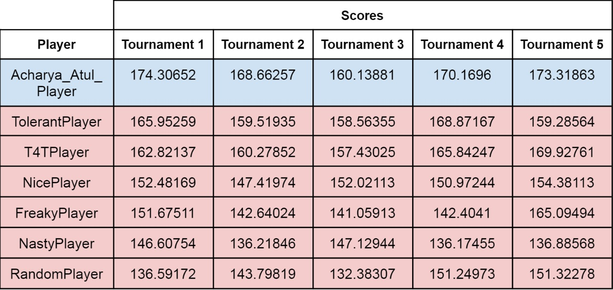

# Three Prisonner's Dilemma


## Agent Rules

The overall strategy of the agent is a mix of Tit-for-Tat and Tolerant. The
agent is designed keeping in mind Axelrod’s suggestions. Below are some
of the rules that the agent will follow for the Three Prisoners Dilemma
Tournament.

1. If it is the first round, then I will cooperate by default
2. If the game is almost over, then I will defect since my opponent does not
have any turns to retaliate
3. If both my opponents cooperated the previous round, then even I will
cooperate
4. If both my opponents defected the previous round, then even I will defect
5. If only one of my opponents cooperated, then I will play “Tolerant Action”

## Definition of Tolerant Action
If anyone of my opponents has defected more than cooperated then I will
defect. Otherwise I will be tolerant and cooperate with them

## Agent Code

```java
public class Agent extends Player {

    int selectAction(int n, int[] myHistory, int[] oppHistory1, int[] oppHistory2) {

		// Rule 1
        if (n == 0) return 0; //cooperate by default

		// Rule 2
        if (n >= 99) return 1; // defect in the end

		// Rule 3, 4, 5
        return oppHistory1[n-1] == oppHistory2[n-1] ? oppHistory1[n-1]:
		playTolerantAction(n, myHistory, oppHistory1, oppHistory2);
    }

    int playTolerantAction(int n, int[] myHistory, int[] oppHistory1, int[] oppHistory2) {
        int opponent1 = 0;
        int opponent2 = 0;

        for (int i = 0 ; i < n; ++i){
            opponent1 += (oppHistory1[i] == 0? 1 : -1);
            
            opponent2 += (oppHistory2[i] == 0? 1: -1);
        }

        if (opponent1 >= 0 && opponent2 >= 0) return 0;
        return 1;

    }
}
```
The Player class can be found in ThreePrisonersDilemma.java

## Results



The agent was tested for 5 tournaments. In all the 5
tournaments, the agent was able to beat all other example strategies.

However, this is not always the case as later tests show the agent losing against the TolerantPlayer and T4TPlayer sometimes.

In conclusion the agent is able to win most of the time against the example agents strategies